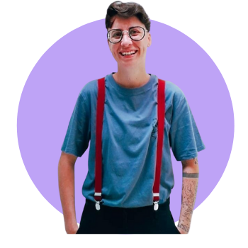
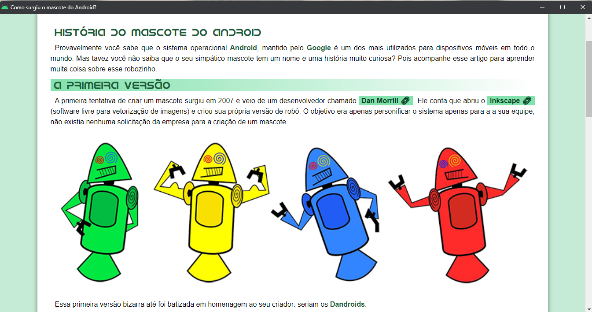
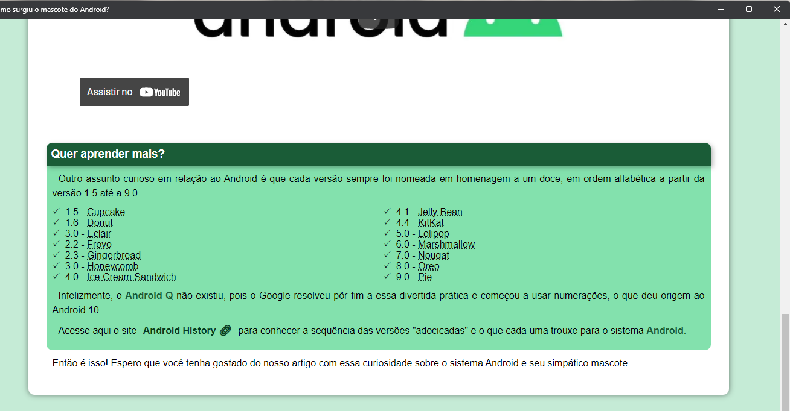
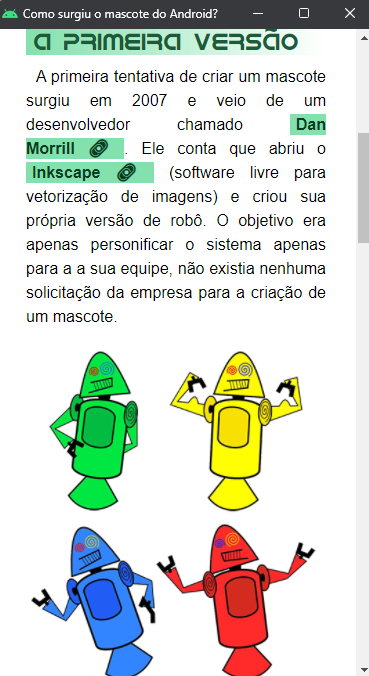
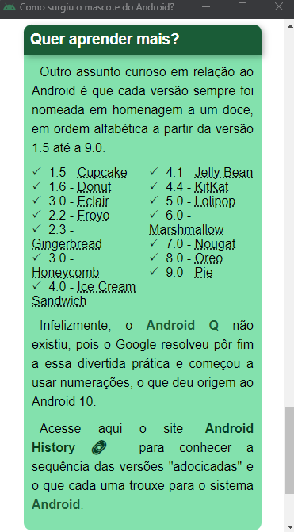

# Site Android

O projeto está finalizado. Esse site foi criado no Curso em Vídeo seguindo a realização de um projeto em aula.

## 🤝 Colaboradores

Agradecemos às seguintes pessoas que contribuíram para este projeto:

<table>
  <tr>
    <td align="center">
      <a href="#">
         
        
          <b><a href="https://github.com/camilabenetasso">Camila Benetasso</a></b>
        
      </a>
    </td>  
        <td align="center">
      <a href="#">
         
        
          <b><a href="https://github.com/gustavoguanabara">Gustavo Guanabara</a></b>
        
      </a>
    </td>
</table>

### Site Finalizado

 

 

> Modelo do site no computador e no celular.

[⬆ Voltar ao topo](#nome-do-projeto) 

 
